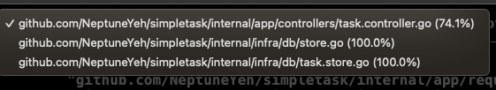
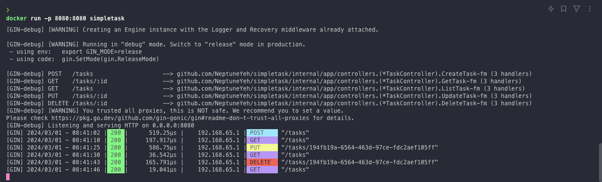

# SimpleTask API

SimpleTask API is a lightweight RESTful service designed for managing tasks. It provides a straightforward way to create, retrieve, update, and delete tasks.

## Getting Started

These instructions will get you a copy of the project up and running on your local machine for development and testing purposes.

### Prerequisites

- [Go](https://golang.org/dl/) (Version 1.18 or later)
- [Docker](https://www.docker.com/get-started) (Optional, for containerization)

### Running Locally

To run the SimpleTask API locally for debugging purposes, follow these steps:

1. Download the Go modules required by the project:
    ```sh
    go mod download
    ```

2. Run the application:
    ```sh
    go run ./cmd/main.go
    ```

The API will be available at `http://localhost:8080`.

## Using Docker

You can also run the SimpleTask API inside a Docker container.

### Building the Docker Image

To build a Docker image for the project, use the following command:

```sh
docker build -t simpletask .
```

This command creates a Docker image named `simpletask` based on the `Dockerfile` in the project root.

### Running the Container

After building the image, you can start a container using:

```sh
docker run -p 8080:8080 simpletask
```
This command runs the simpletask container and maps port 8080 of the container to port 8080 on your host, making the API accessible at http://localhost:8080.


### Test Coverage

The project aims for comprehensive test coverage to ensure reliability. Below is the current test coverage report:



### Running Container Screenshot

Below is a screenshot of the SimpleTask API running successfully inside a Docker container:


